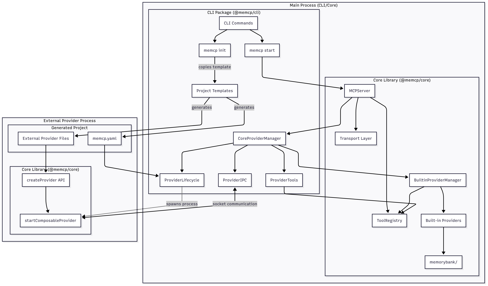

# General Architecture Walkthrough

## Overview

MEMCP implements an architecture that separates concerns between **CLI management**, **Core protocol implementation**, and **Generated projects**. At its heart lies the Model Context Protocol (MCP) - an industry-standard JSON-RPC 2.0 protocol that enables AI assistants to communicate with external tools and resources.

The architecture's flexibility comes from its **dual provider system** - built-in providers (like memorybank) run in-process for tighter CLI integration, while external providers run as separate Node.js processes for isolation and hot reload capabilities. This design enables seamless integration with CLI functionality while maintaining the flexibility to update providers without client disconnection.

Understanding this architecture starts with `MCPServer` - the central orchestrator that coordinates transports and provider systems into a cohesive MCP-compliant server that can serve any MCP client.

---

## System Architecture

### System Boundaries


### Module Boundary Enforcement

The architecture enforces clean separation through **package-level APIs** with specific export patterns:

```typescript
// @memcp/core - Protocol implementation (PUBLIC API)
export {
  MCPServer,            // Core server class
  ToolRegistry,        // Tool coordination
  createProvider,      // Provider development API
  createTool,         // Tool development API
} from "@memcp/core";

// @memcp/cli - Management and tooling (INTERNAL, used by CLI commands)
import {
  CoreProviderManager, // External provider management
  HotReloadManager,   // Configuration hot reload
} from "@memcp/cli/exports";

// Generated projects - Provider development (USER CODE)
import {
  createProvider,          // Creates provider via ComposableProviderConfig
  createTool,             // Creates tool via AdvancedToolDefinition
  startComposableProvider, // Starts provider process
} from "@memcp/core";
```

**Method Integration Across Packages**:

- **CLI Package**: `enhancedStartCommand()` creates `MCPServer` instances
- **Core Package**: `MCPServer#handleMessage()` processes protocol requests
- **Generated Projects**: `createProvider()` used by user code, executed via `startComposableProvider()`

**Key Insight**: Users **only interact with** `@memcp/core` package exports when writing providers. The CLI package handles all management concerns internally via classes like `CoreProviderManager`, maintaining clean separation between **protocol implementation** (Core) and **development tooling** (CLI).

---

## Core Components

### MCPServer Class

The `MCPServer` class serves as our architectural anchor point because it demonstrates the CLI→Core→Project relationship most clearly. Every MEMCP server, regardless of complexity, centers around this orchestrator.

#### MCPServer Structure Overview

```typescript
export class MCPServer extends EventEmitter {
  // Core dependencies injected via constructor
  private config: MCPServerConfig;
  private toolRegistry: ToolRegistry;
  private logger: Logger;
  private validator: JSONRPCValidator;

  // Component systems coordinated by MCPServer
  private transports: Map<string, MessageTransport> = new Map();
  private providerManager?: ProviderManager;

  // Server lifecycle state
  private isRunning: boolean = false;
  private startTime?: Date;

  // Core methods we'll explore in detail
  constructor(config, toolRegistry, logger) { /* ... */ }
  private setupTransports() { /* ... */ }
  private handleMessage(message) { /* ... */ }
  setProviderManager(manager) { /* ... */ }
  async start() { /* ... */ }

  // ... additional lifecycle and utility methods ...
}
```

#### Key MCPServer Methods

##### Constructor

The `MCPServer#constructor()` establishes the foundational architecture:

```typescript
constructor(config: MCPServerConfig, toolRegistry: ToolRegistry, logger: Logger) {
  super();

  // 1. Store core dependencies (dependency injection pattern)
  this.config = config;
  this.toolRegistry = toolRegistry;
  this.logger = logger;

  // 2. Initialize protocol components
  this.validator = new JSONRPCValidator();

  // 3. Set up integration systems (calls to other MCPServer methods)
  this.setupTransports();                  // → Calls MCPServer#setupTransports()
  this.setupProviderManagerIntegration();  // → Sets up provider event handling
}
```

##### Message Handling

The `MCPServer#handleMessage()` method showcases MEMCP's core protocol implementation:

```typescript
private async handleMessage(message: JSONRPCMessage): Promise<JSONRPCResponse> {
  const startTime = performance.now();
  const correlationId = `req_${Date.now()}_${Math.random().toString(36).substr(2, 9)}`;

  try {
    // 1. JSON-RPC validation using this.validator
    const validation = this.validator.validateMessage(message);
    if (!validation.isValid) {
      return validation.error!; // MCP-compliant error response
    }

    // 2. Add request timeout handling
    const requestTimeout = this.config.performance.requestTimeout;
    const timeoutPromise = new Promise<JSONRPCResponse>((_, reject) => {
      setTimeout(() => {
        reject(new Error(`Request timeout after ${requestTimeout}ms`));
      }, requestTimeout);
    });

    // 3. Method routing with timeout protection
    const request = message as JSONRPCRequest;
    const methodPromise = this.handleMethodWithErrorHandling(request, correlationId);

    // 4. Race against timeout to ensure responsiveness
    const response = await Promise.race([methodPromise, timeoutPromise]);

    return response;
  } catch (error) {
    // 5. Comprehensive error categorization and logging
    return this.createErrorResponse(error, correlationId);
  }
}
```

The `handleMethodWithErrorHandling()` method provides **centralized error handling** for all MCP method calls:

```typescript
private async handleMethodWithErrorHandling(
  request: JSONRPCRequest,
  correlationId: string
): Promise<JSONRPCResponse> {
  try {
    switch (request.method) {
      case 'initialize':
        return await this.handleInitialize(request as MCPInitializeRequest);
      case 'ping':
        return await this.handlePing(request);
      case 'tools/list':
        return await this.handleToolsList(request as ToolListRequest);
      case 'tools/call':
        return await this.handleToolCall(request as ToolCallRequest);
      default:
        // Returns METHOD_NOT_FOUND error with available methods
        return this.createMethodNotFoundError(request, correlationId);
    }
  } catch (methodError) {
    // Consistent error logging and JSON-RPC error response formatting
    return this.createMethodErrorResponse(methodError, request, correlationId);
  }
}
```

##### Transport Integration

The `MCPServer#setupTransports()` method demonstrates MEMCP's **transport abstraction pattern**:

```typescript
private setupTransports(): void {
  const { transport } = this.config;

  // Polymorphic transport creation based on configuration
  if (transport.type === "http" || transport.type === "both") {
    if (transport.http) {
      const httpTransport = new HTTPTransport(transport);
      this.transports.set("http", httpTransport);
    }
  }

  if (transport.type === "stdio" || transport.type === "both") {
    if (transport.stdio) {
      const stdioTransport = new StdioTransport(transport);
      this.transports.set("stdio", stdioTransport);
    }
  }
}
```

During `MCPServer#start()`, each transport calls:

```typescript
async start(): Promise<void> {
  // ... startup validation ...

  // Start all transports with message handler integration
  for (const [name, transport] of this.transports.entries()) {
    // Critical integration: transport routes messages to MCPServer#handleMessage()
    transport.onMessage(async (message: JSONRPCMessage) => {
      return await this.handleMessage(message);
    });

    await transport.start();
  }

  // ... completion and event emission ...
}
```

**Key Architectural Insight**: Both `HTTPTransport` and `StdioTransport` implement the same `MessageTransport` interface, enabling **protocol uniformity**.

##### Provider Manager Integration

The `MCPServer#setProviderManager()` method demonstrates **external provider system integration**:

```typescript
setProviderManager(providerManager: ProviderManager): void {
  this.providerManager = providerManager;

  // Event-driven tool registration from external providers
  providerManager.on("tool-registered", (tool) => {
    // Integration: External provider tools → MCPServer ToolRegistry
    this.toolRegistry.registerTool(tool);
    this.logger.debug("Tool registered in MCP server", {
      toolName: tool.name,
      provider: tool.provider,
    });
    this.emit("tool-registered", { tool });
  });

  providerManager.on("tool-unregistered", (data) => {
    const toolName = typeof data === "string" ? data : data.toolName;
    // Integration: Tool removal triggers ToolRegistry#unregisterTool()
    this.toolRegistry.unregisterTool(toolName);
    this.logger.debug("Tool unregistered from MCP server", { toolName });
    this.emit("tool-unregistered", { toolName });
  });

  // ... provider-connected, provider-disconnected, provider-reloaded events ...
}
```

### Tool Registry Coordination

The `ToolRegistry` represents MEMCP's **dual provider architecture**:

```typescript
export class ToolRegistry implements ToolRegistryInterface {
  // Core data structures for tool management
  private tools: Map<string, ToolWithProvider> = new Map();
  private providerTools: Map<string, Set<string>> = new Map();

  registerTool(tool: ToolWithProvider): void {
    // Store tool and track by provider
    this.tools.set(tool.name, tool);

    // Maintain provider-to-tools mapping for cleanup during hot reload
    if (!this.providerTools.has(tool.provider)) {
      this.providerTools.set(tool.provider, new Set());
    }
    this.providerTools.get(tool.provider)!.add(tool.name);
  }

  // Tools available to MCP clients via MCPServer#handleToolsList()
  getAllTools(): ToolWithProvider[] {
    return Array.from(this.tools.values());
  }

  // ... unregisterTool(), clearProviderTools(), etc. ...
}
```

**Integration Point**: `MCPServer#handleToolsList()` uses the ToolRegistry:

```typescript
private async handleToolsList(request: ToolListRequest): Promise<ToolListResponse> {
  // Direct integration with ToolRegistry#getAllTools()
  const tools = this.toolRegistry.getAllTools();

  this.logger.debug("Tools list requested", { toolCount: tools.length });

  return {
    jsonrpc: "2.0",
    id: request.id,
    result: {
      tools: tools.map((tool) => ({
        name: tool.name,
        description: tool.description,
        inputSchema: tool.inputSchema,
        outputSchema: tool.outputSchema,
        provider: tool.provider,
      })),
    },
  };
}
```

The `MCPServer#handleToolCall()` routes to providers:

```typescript
private async handleToolCall(request: ToolCallRequest): Promise<ToolCallResponse> {
  const { name: toolName, arguments: argsRaw } = request.params;
  const args = argsRaw ?? {};

  // 1. Tool lookup in shared registry via ToolRegistry#getTool()
  const tool = this.toolRegistry.getTool(toolName);
  if (!tool) {
    return this.createToolNotFoundError(toolName);
  }

  // 2. Route execution to provider manager
  if (this.providerManager) {
    // Integration: MCPServer delegates to ProviderManager for external provider execution
    const result = await this.providerManager.callTool(toolName, args);
    return this.formatToolResponse(result, request.id);
  } else {
    throw new Error("No provider manager available for tool execution");
  }
}
```

---

## Critical Implementation Details

### Shared ToolRegistry Architecture

The **most critical architectural insight** is the shared `ToolRegistry` pattern and how different components interact with it:

```typescript
// CLI creates shared registry in enhancedStartCommand()
const toolRegistry = new ToolRegistry();

// Core server uses same instance via MCPServer#constructor()
const mcpServer = new MCPServer(serverConfig, toolRegistry, logger);
//    └─ MCPServer stores toolRegistry and uses it in MCPServer#handleToolsList()

// Built-in providers register directly via ToolRegistry#registerTool()
const builtinManager = new BuiltinProviderManager(toolRegistry, logger);
//    └─ MemorybankProvider#getTools() → BuiltinProviderManager calls ToolRegistry#registerTool()

// External providers register via events through MCPServer#setProviderManager()
const providerManager = new CoreProviderManager(config, /* ... */, toolRegistry);
mcpServer.setProviderManager(providerManager);
//    └─ Sets up event listeners: 'tool-registered' → MCPServer calls ToolRegistry#registerTool()
```

**Why This Matters**: Using the **same ToolRegistry instance** ensures that when an MCP client calls `tools/list`, `MCPServer#handleToolsList()` calls `ToolRegistry#getAllTools()` and returns tools from both built-in providers (like `memorybank-fetch`) and external providers (like `add`, `multiply`) in a unified response.

### Configuration-Driven Architecture

The `memcp.yaml` file drives the entire architecture through method calls:

```yaml
version: "1.0"
name: "basic-server"

# Built-in provider configuration → BuiltinProviderManager#initialize()
memorybank:
  root: "./memorybank"
  enabled: true
  watchForChanges: true

# External provider configuration → CoreProviderManager#start()
providers:
  calculator:
    type: "file"
    path: "./providers/calculator.ts"

# Transport configuration → MCPServer#setupTransports()
server:
  transport: "http"
  port: 3000

# Development features → HotReloadManager#initialize()
dev:
  hotReload: true
```

**Method Integration Flow**:

- **Transport setup**: `enhancedStartCommand()` reads `server.transport` → `MCPServer#setupTransports()`
- **Built-in provider enablement**: `memorybank.enabled` → `BuiltinProviderManager#initialize()` → `MemorybankProvider#initialize()`
- **External provider spawning**: `providers.calculator` → `CoreProviderManager#start()` → `ProviderLifecycle#spawn()`
- **Development features**: `dev.hotReload` → `HotReloadManager#initialize()` → `ConfigWatcher#startWatching()`

---

## Integration Patterns

### CLI-Core Integration

The `enhancedStartCommand()` demonstrates how the **CLI creates and configures** the core server:

```typescript
// CLI orchestration function in enhanced-start.ts
export async function enhancedStartCommand(options: EnhancedStartOptions): Promise<void> {
  // 1. Configuration loading and parsing
  const configPath = resolve(options.config);
  const configContent = readFileSync(configPath, 'utf8');
  const config = parseYaml(configContent);

  // 2. Create shared tool registry (critical for dual provider architecture)
  const toolRegistry = new ToolRegistry();

  // 3. Create MCPServer with CLI options merged into config
  const mcpServer = new MCPServer(serverConfig, toolRegistry, logger);
  //    └─ Calls MCPServer#constructor() which calls MCPServer#setupTransports()

  // 4. Initialize built-in providers (memorybank, monitoring)
  if (config.memorybank) {
    // Built-in providers register tools directly via ToolRegistry#registerTool()
    const builtinManager = new BuiltinProviderManager(toolRegistry, logger);
    await builtinManager.initialize(config);
  }

  // 5. Initialize external providers (calculator.ts, custom providers)
  if (config.providers) {
    const providerManager = new CoreProviderManager(config, /* ... */, toolRegistry);
    // Integration: Connect provider events to MCPServer tool registry
    mcpServer.setProviderManager(providerManager);
    //    └─ Calls MCPServer#setProviderManager() setting up event listeners

    // 6. Start in correct sequence: MCPServer first, then providers
    await mcpServer.start();        // → Calls MCPServer#start()
    await providerManager.start();  // → Spawns external provider processes
  }

  // ... server information display and keep-alive ...
}
```

**Key Integration Flow**:

1. `enhancedStartCommand()` creates `MCPServer` instance
2. `MCPServer#constructor()` calls `MCPServer#setupTransports()`
3. `enhancedStartCommand()` calls `MCPServer#setProviderManager()`
4. `MCPServer#start()` connects transports to `MCPServer#handleMessage()`

### Production Server Setup

```typescript
// Production server setup (enhanced-start.ts pattern)
async function createProductionServer(configPath: string): Promise<MCPServer> {
  // 1. Load configuration
  const config = parseYaml(readFileSync(configPath, 'utf8'));

  // 2. Create shared infrastructure
  const toolRegistry = new ToolRegistry();
  const logger = new Logger("production", "mcp-server");

  // 3. Configure for production
  const serverConfig: MCPServerConfig = {
    transport: { type: "http", http: { port: 443, cors: false } },
    performance: { requestTimeout: 30000, toolCallTimeout: 30000 }
  };

  // 4. Create server with production settings
  const mcpServer = new MCPServer(serverConfig, toolRegistry, logger);
  //    └─ MCPServer#constructor() → MCPServer#setupTransports()

  // 5. Initialize provider systems
  const builtinManager = new BuiltinProviderManager(toolRegistry, logger);
  await builtinManager.initialize(config);
  //    └─ MemorybankProvider#initialize() → ToolRegistry#registerTool()

  const providerManager = new CoreProviderManager(config, /* ... */, toolRegistry);
  mcpServer.setProviderManager(providerManager);
  //    └─ MCPServer#setProviderManager() → event listener setup

  return mcpServer;
}
```

---

## End-to-End Flows

### Request Processing Flow

Here's how a complete tool execution flows through the architecture:

#### 1. Client Request

```json
{
  "jsonrpc": "2.0",
  "method": "tools/call",
  "params": { "name": "add", "arguments": { "a": 5, "b": 3 } },
  "id": 1
}
```

#### 2. Transport Processing

```
HTTPTransport#setupMiddleware() 
  → Express middleware processes request
  → BaseTransport#processMessage() 
  → JSON parsing and validation
  → MessageHandler callback 
  → MCPServer#handleMessage()
```

#### 3. Message Handling

```
MCPServer#handleMessage()
  → JSONRPCValidator#validateMessage() 
  → Protocol validation
  → MCPServer#handleMethodWithErrorHandling() 
  → Centralized method routing & error handling
  → MCPServer#handleToolCall() 
  → Tool execution coordination
```

#### 4. Tool Registry Lookup

```
MCPServer#handleToolCall() calls:
  this.toolRegistry.getTool("add") 
  → ToolRegistry#getTool()
  // Returns: { name: "add", provider: "calculator", inputSchema: {...} }
```

#### 5. Provider Execution

```
MCPServer#handleToolCall() calls:
  this.providerManager.callTool("add", { a: 5, b: 3 })
  → CoreProviderManager#callTool() 
  → IPC message to calculator.ts process
  → calculator provider executes addTool.execute()
  // Returns: { result: 8, operation: "addition", precision: 2 }
```

#### 6. Response Formatting

```json
{
  "jsonrpc": "2.0",
  "id": 1,
  "result": {
    "content": [{
      "type": "text",
      "text": "{\"result\": 8, \"operation\": \"addition\", \"precision\": 2}"
    }],
    "isError": false
  }
}
```

### Development Workflow

The complete lifecycle from project creation to serving:

#### 1. Project Creation

```bash
# Create project using template
memcp init my-calculator --no-install
  # → CLI template processor copies basic-server template
  # → Creates memcp.yaml with calculator provider configuration

cd my-calculator
```

#### 2. Provider Development

```typescript
// User code in generated project using @memcp/core API
import { createProvider, createTool, startComposableProvider } from "@memcp/core";

const customTool = createTool({
  name: "square",
  description: "Square a number",
  inputSchema: {
    type: "object",
    properties: { n: { type: "number" } },
    required: ["n"],
  },
  execute: async ({ n }, context) => {
    const precision = context?.state?.precision || 2;
    const result = n * n;
    return { result: Number(result.toFixed(precision)), operation: "square" };
  },
});

const provider = createProvider({
  name: "calculator",
  version: "1.0.0",
  description: "Enhanced calculator with custom tools",
  tools: [addTool, multiplyTool, customTool], // Adding custom tool

  initialize: async (current, previous, context) => {
    // Provider initialization with state management
    return {
      precision: current.config?.precision || 2,
      initialized: true,
    };
  },
});

// Auto-start when run as provider process
if (process.env.MEMCP_RUN_AS_PROVIDER === "true") {
  startComposableProvider(provider);
  // → Runtime system handles IPC communication with CoreProviderManager
}
```

#### 3. Server Startup

```bash
# Start development server with hot reload
memcp dev --port 3001
```

**Method Execution Trace**:

```
memcp start --port 3001
  ↓
enhancedStartCommand(options)
  ↓
new MCPServer(serverConfig, toolRegistry, logger)
  ↓ MCPServer#constructor() calls:
  → MCPServer#setupTransports()      // Creates HTTP/Stdio transports

  ↓ Enhanced start continues:
mcpServer.setProviderManager(providerManager)
  ↓ MCPServer#setProviderManager() calls:
  → providerManager.on('tool-registered', handler)  // Event listener setup
  → providerManager.on('tool-unregistered', handler)

  ↓ Final startup sequence:
await mcpServer.start()
  ↓ MCPServer#start() calls:
  → transport.onMessage(MCPServer#handleMessage)  // Connect message handler
  → transport.start()  // Start HTTP server on port 3001

await providerManager.start()
  ↓ Spawns calculator.ts process which calls:
  → startComposableProvider(provider)  // Provider process startup
  → IPC registration messages → MCPServer ToolRegistry#registerTool()
```

#### 4. Testing the Server

```bash
# Test tools/list
curl -X POST http://localhost:3001/mcp \
  -H "Content-Type: application/json" \
  -d '{"jsonrpc": "2.0", "method": "tools/list", "id": 1}'
```

**Execution Trace**:
```
HTTPTransport middleware 
  → MCPServer#handleMessage()
  → MCPServer#handleToolsList() 
  → ToolRegistry#getAllTools()
  → Returns: [
      {"name": "add", "provider": "calculator"},
      {"name": "square", "provider": "calculator"},
      {"name": "memorybank-fetch", "provider": "memorybank"}
    ]
```

```bash
# Test tools/call
curl -X POST http://localhost:3001/mcp \
  -H "Content-Type: application/json" \
  -d '{"jsonrpc": "2.0", "method": "tools/call",
       "params": {"name": "square", "arguments": {"n": 7}}, "id": 2}'
```

**Execution Trace**:
```
HTTPTransport middleware 
  → MCPServer#handleMessage()
  → MCPServer#handleToolCall() 
  → ToolRegistry#getTool("square")
  → CoreProviderManager#callTool() 
  → IPC to calculator.ts
  → customTool.execute({n: 7}) 
  → Returns {result: 49, operation: "square"}
```

---

## Conclusion

The MEMCP general architecture provides a **scalable foundation** for building MCP servers through:

1. **Clean Separation**: CLI (management via `enhancedStartCommand()`) → Core (protocol via `MCPServer#handleMessage()`) → Projects (providers via `createProvider()`)

2. **Unified Tool Registry**: Single source of truth via `ToolRegistry#getAllTools()` for built-in and external tools

3. **Transport Abstraction**: HTTP and Stdio support with identical message handling via `MCPServer#handleMessage()`

4. **Provider Flexibility**: In-process built-ins (via `BuiltinProviderManager#initialize()`) for tight CLI integration, external processes (via `ProviderLifecycle#spawn()`) for user extensibility and isolation

5. **Configuration-Driven**: Single YAML file controls entire system behavior through `enhancedStartCommand()` orchestration

New developers can **start with the MCPServer class** and its core methods (`#constructor()`, `#handleMessage()`, `#setupTransports()`) to understand protocol implementation, then **trace outward** to transport integration, provider coordination, and CLI orchestration. This foundation-first approach builds understanding from the core protocol up to the complete development and production experience.

**Next Walkthrough**: IPC and Provider Interface - Deep dive into the dual provider architecture and inter-process communication patterns that enable hot reload and provider isolation, anchored on `ProviderLifecycle#spawn()` and the complete IPC method chain.