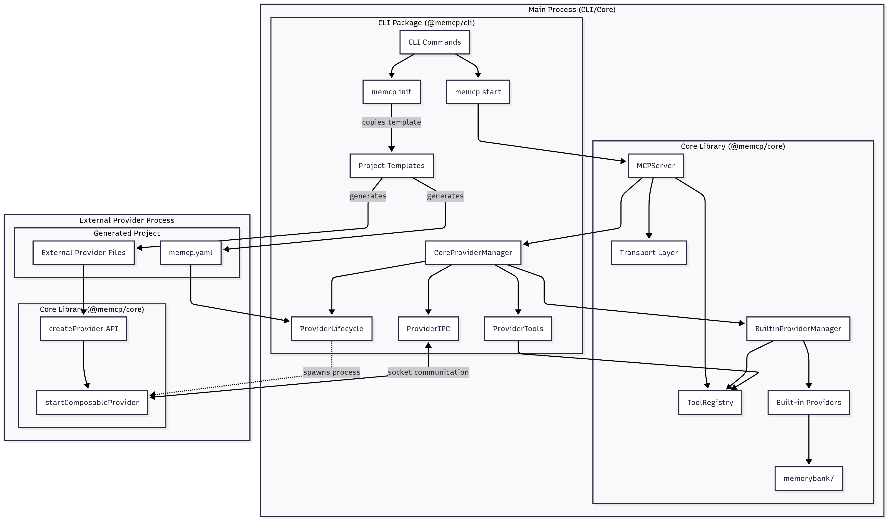

# IPC and Provider Interface Walkthrough

## Overview

MEMCP's **dual provider architecture** balances tight integration capabilities with flexible user extension. Built-in providers (like memorybank) run directly within the main process for seamless CLI integration, while external providers run as separate Node.js processes communicating via Unix domain sockets for isolation, hot reload capabilities, and development flexibility.

The architecture's sophistication lies in its **seamless provider abstraction** - from an MCP client's perspective, all tools appear identical regardless of whether they execute in-process or across process boundaries. However, the integration characteristics differ significantly:

- **Built-in Provider Execution**: Direct method calls → Tighter CLI integration → Access to internal state and configuration
- **External Provider Execution**: IPC communication → Process isolation → User extensibility and hot reload

This enables hot reloading providers without disconnecting clients, atomic tool replacement during updates, and mixed provider ecosystems where tools requiring tight CLI integration run in-process while user-developed tools run in isolated processes for maximum development flexibility.

Understanding this architecture requires examining both execution paths: the `ProviderLifecycle` orchestrator for external providers, and the `BuiltinProviderManager` for direct in-process execution.

---

## System Architecture

### System Boundaries



---

## External Provider Architecture (Main Process)

### ProviderLifecycle Class

The `ProviderLifecycle` class serves as our architectural anchor point for external provider management. Every external provider process, regardless of implementation language or complexity, is spawned and managed through this orchestrator.

#### ProviderLifecycle Structure

```typescript
export class ProviderLifecycle extends EventEmitter {
  // Core configuration and tracking
  private config: MemcpConfig;
  private providers: Map<string, ProviderInfo> = new Map();
  private startupResults: Map<string, ProviderStartupResult> = new Map();
  private logger: Logger;

  // Core methods we'll explore in detail
  constructor(config, logger) { /* ... */ }
  async startProvider(name, config, prepareEnvironment) { /* ... */ }
  private async startFileProvider(name, config, providerInfo, prepareEnvironment) { /* ... */ }
  private determineProviderRuntime(providerPath, config) { /* ... */ }
  private handleProviderOutput(name, process) { /* ... */ }
  async stopProvider(providerName) { /* ... */ }
  markProviderRegistered(providerName, duration) { /* ... */ }

  // ... additional lifecycle and utility methods ...
}
```

#### Provider Spawning

The `ProviderLifecycle#startProvider()` establishes the foundational provider spawning architecture:

```typescript
async startProvider(
  name: string,
  config: any,
  prepareEnvironment: (name: string, config: any) => Record<string, string>
): Promise<void> {
  this.logger.info("Starting provider", { name });

  // 1. Create provider info tracking structure
  const providerInfo: ProviderInfo = {
    name,
    config,
    status: "starting",
    startTime: new Date(),
    restartCount: 0,
    tools: [], // Initialize tools array
  };

  // 2. Store provider tracking state
  this.providers.set(name, providerInfo);

  // 3. Route to appropriate provider type handler
  if (config.type === "file") {
    await this.startFileProvider(name, config, providerInfo, prepareEnvironment);
    // → Calls ProviderLifecycle#startFileProvider()
  } else {
    throw new Error(`Unsupported provider type: ${config.type}`);
  }
}
```

The `ProviderLifecycle#startFileProvider()` method showcases MEMCP's core process spawning implementation:

```typescript
private async startFileProvider(
  name: string,
  config: any,
  providerInfo: ProviderInfo,
  prepareEnvironment: (name: string, config: any) => Record<string, string>
): Promise<void> {
  const providerPath = resolve(config.path);

  // 1. Validate provider file exists
  if (!existsSync(providerPath)) {
    throw new Error(`Provider file not found: ${providerPath}`);
  }

  // 2. Prepare environment with IPC coordination variables
  const env = prepareEnvironment(name, config);
  // → Sets MEMCP_SOCKET_PATH, MEMCP_RUN_AS_PROVIDER, MEMCP_PROVIDER_NAME

  // 3. Determine runtime based on file extension and configuration
  const runtime = this.determineProviderRuntime(providerPath, config);

  // 4. Spawn provider process with IPC environment
  const providerProcess = spawn(
    runtime.command,
    [...runtime.args, providerPath],
    {
      cwd: process.cwd(), // Use project root for module resolution
      env: { ...process.env, ...env },
      stdio: ["pipe", "pipe", "pipe"],
    }
  );

  // 5. Establish process tracking and communication
  providerInfo.process = providerProcess;
  providerInfo.pid = providerProcess.pid;

  // 6. Set up process output handling and lifecycle events
  this.handleProviderOutput(name, providerProcess);

  this.logger.info("Provider spawned", { name, pid: providerProcess.pid });
}
```

#### Runtime Detection

The `ProviderLifecycle#determineProviderRuntime()` method demonstrates MEMCP's **cross-language provider support**:

```typescript
private determineProviderRuntime(
  providerPath: string,
  config: any
): { command: string; args: string[] } {
  // 1. Check for explicit runtime configuration override
  if (config.runtime) {
    if (typeof config.runtime === "string") {
      return { command: config.runtime, args: [] };
    }
    if (config.runtime.command) {
      return {
        command: config.runtime.command,
        args: config.runtime.args || [],
      };
    }
  }

  // 2. Auto-detect runtime based on file extension
  const ext = providerPath.split(".").pop()?.toLowerCase();

  switch (ext) {
    case "ts":
      // Hot reload optimization: cache-busting for TypeScript compilation
      return process.versions.bun
        ? { command: "bun", args: ["--no-cache"] }
        : { command: "npx", args: ["tsx"] };

    case "js":
    case "mjs":
      return { command: "node", args: [] };

    case "py":
      return { command: "python3", args: [] };

    default:
      // Fallback to Node.js for unknown extensions
      return { command: "node", args: [] };
  }
}
```

**Key Architectural Insights**:

1. **Process Isolation**: `ProviderLifecycle#startFileProvider()` spawns completely isolated Node.js processes
2. **IPC Coordination**: Environment variables enable socket-based communication via `prepareEnvironment()`
3. **Runtime Detection**: Supports TypeScript with cache-busting (`--no-cache` for Bun, `tsx` for Node.js) to ensure hot reload picks up modified provider code immediately during development

### IPC Communication

The `ProviderIPC` class represents MEMCP's **inter-process communication foundation**:

#### Socket Server Setup

```typescript
export class ProviderIPC extends EventEmitter {
  // Core IPC infrastructure
  private socketServer: Server;
  private socketPath: string;
  private providerSockets: Map<string, Socket> = new Map();
  private logger: Logger;

  async startSocketServer(): Promise<void> {
    return new Promise((resolve, reject) => {
      this.socketServer.listen(this.socketPath, () => {
        this.logger.info("Provider socket server listening", {
          socketPath: this.socketPath,
        });
        resolve();
      });

      this.socketServer.on("error", reject);
    });
  }
}
```

#### Connection Handling

`ProviderIPC#handleConnection()` processes incoming provider registrations:

```typescript
private handleConnection(socket: Socket): void {
  let buffer = "";
  let providerId: string | null = null;

  socket.on("data", (data: Buffer) => {
    buffer += data.toString();

    // 1. Process newline-delimited JSON messages
    let newlineIndex;
    while ((newlineIndex = buffer.indexOf("\n")) !== -1) {
      const messageStr = buffer.slice(0, newlineIndex);
      buffer = buffer.slice(newlineIndex + 1);

      if (messageStr.trim()) {
        try {
          const message = JSON.parse(messageStr);

          // 2. Handle provider registration messages
          if (message.type === "register") {
            const effectiveProviderId =
              message.providerId ||
              message.data?.pid?.toString() ||
              `unknown-${Date.now()}`;
            providerId = effectiveProviderId;

            // 3. Store socket mapping for future communication
            this.providerSockets.set(message.data.name, socket);

            // 4. Emit registration event for CoreProviderManager processing
            this.emit("provider-registration", message, socket);
            // → Triggers CoreProviderManager#handleProviderRegistration()
          } else if (message.type === "tool_response") {
            // 5. Route tool execution responses
            this.emit("tool-response", message);
          } else {
            // 6. Handle other provider messages
            this.emit("provider-message", message, socket);
          }
        } catch (error) {
          this.logger.error("Failed to parse provider message", {
            error: error.message,
          });
          this.emit("message-parse-error", error, messageStr);
        }
      }
    }
  });

  // 7. Handle provider disconnections
  socket.on("close", () => {
    if (providerId) {
      // Find and remove provider socket
      for (const [providerName, providerSocket] of this.providerSockets.entries()) {
        if (providerSocket === socket) {
          this.providerSockets.delete(providerName);
          this.emit("provider-disconnection", providerId, providerName);
          break;
        }
      }
    }
  });
}
```

**Key Architectural Insight**: The IPC system uses **newline-delimited JSON** over Unix domain sockets, enabling reliable message framing and efficient parsing with minimal overhead for high-frequency tool calls.

### Tool Management

The `ProviderTools` class demonstrates **unified tool coordination** across provider boundaries:

#### Tool Registration

```typescript
export class ProviderTools extends EventEmitter {
  // Core tool management state
  private tools: Map<string, ToolDefinition> = new Map();
  private pendingToolCalls: Map<string, {
    resolve: (value: any) => void;
    reject: (error: Error) => void;
    timestamp: number;
  }> = new Map();

  registerProviderTools(providerName: string, tools: ToolDefinition[]): void {
    this.logger.debug("Registering tools for provider", {
      providerName,
      toolCount: tools.length,
    });

    for (const tool of tools) {
      // 1. Add provider association to tool definition
      const toolWithProvider: ToolDefinition = {
        ...tool,
        provider: providerName,
      };

      // 2. Store tool in unified registry
      this.tools.set(tool.name, toolWithProvider);

      // 3. Emit tool registration event for MCPServer integration
      this.emit("tool-registered", toolWithProvider);
      // → Connects to MCPServer via CoreProviderManager event forwarding
    }
  }
}
```

#### Tool Execution with IPC Correlation

`ProviderTools#callTool()` routes execution across process boundaries:

```typescript
async callTool(
  toolName: string,
  args: any,
  providers: Map<string, ProviderInfo>,
  sendMessageToProvider: (providerName: string, message: any) => Promise<void>
): Promise<{
  success: boolean;
  result?: any;
  error?: string;
  executionTime?: number;
}> {
  const startTime = performance.now();
  const callId = `tool-${Date.now()}-${Math.random().toString(36).substr(2, 9)}`;

  // 1. Validate tool existence and provider status
  const tool = this.tools.get(toolName);
  if (!tool) {
    return {
      success: false,
      error: `Tool not found: ${toolName}`,
      executionTime: performance.now() - startTime,
    };
  }

  const providerInfo = providers.get(tool.provider!);
  if (!providerInfo || 
      (providerInfo.status !== "running" && providerInfo.status !== "starting")) {
    return {
      success: false,
      error: `Provider ${tool.provider} is not running (status: ${providerInfo?.status})`,
      executionTime: performance.now() - startTime,
    };
  }

  // 2. Create promise-based execution tracking
  return new Promise((resolve) => {
    const timeout = setTimeout(() => {
      this.pendingToolCalls.delete(callId);
      resolve({
        success: false,
        error: `Tool call timeout after 30000ms: ${toolName}`,
        executionTime: performance.now() - startTime,
      });
    }, 30000);

    // 3. Store pending call for response correlation
    this.pendingToolCalls.set(callId, {
      resolve: (result) => {
        clearTimeout(timeout);
        resolve({
          success: true,
          result,
          executionTime: performance.now() - startTime,
        });
      },
      reject: (error) => {
        clearTimeout(timeout);
        resolve({
          success: false,
          error: error.message,
          executionTime: performance.now() - startTime,
        });
      },
      timestamp: Date.now(),
    });

    // 4. Send tool call message via IPC
    const providerMessage = {
      type: "tool_call",
      id: callId,
      data: {
        toolName,
        params: args,
        callId,
        timestamp: Date.now(),
      },
    };

    // 5. Route to provider via ProviderIPC#sendMessageToProvider()
    sendMessageToProvider(tool.provider!, providerMessage).catch((writeError) => {
      clearTimeout(timeout);
      this.pendingToolCalls.delete(callId);
      resolve({
        success: false,
        error: `Failed to communicate with provider: ${writeError.message}`,
        executionTime: performance.now() - startTime,
      });
    });
  });
}
```

**Key Architectural Insight**: The tool execution system maintains **request-response correlation** using unique call IDs, enabling concurrent tool calls to different providers while ensuring responses are properly matched to their originating requests.

---

## Provider Process Architecture

### Provider Development API

The `createProvider()` function demonstrates the **user-facing provider development API**:

```typescript
export function createProvider(
  config: ComposableAdvancedProviderConfig
): AdvancedProvider {
  // 1. Attach provider name to all tools for routing
  const toolsWithProvider = config.tools.map((tool) => ({
    ...tool,
    provider: config.name,
  }));

  // 2. Create advanced provider with lifecycle hooks
  return {
    name: config.name,
    version: config.version,
    description: config.description,
    tools: toolsWithProvider,
    initialize: config.initialize,         // → State management hook
    shouldRestart: config.shouldRestart,   // → Hot reload decision hook
    shouldReinitialize: config.shouldReinitialize, // → State update hook
    dispose: config.dispose,               // → Cleanup hook
  };
}

export function createTool(config: {
  name: string;
  description: string;
  inputSchema: {
    type: "object";
    properties?: Record<string, any>;
    required?: string[];
  };
  outputSchema?: { type: "object"; properties?: Record<string, any> };
  execute?: (params: any, context: ExecutionContext) => Promise<any>;
}): AdvancedToolDefinition {
  return {
    name: config.name,
    description: config.description,
    inputSchema: config.inputSchema,
    outputSchema: config.outputSchema,
    provider: "", // Will be set by createProvider
    execute: config.execute, // → Receives ExecutionContext with provider state
  };
}
```

### Provider Runtime

`startComposableProvider()` bridges user code to IPC system:

```typescript
export async function startComposableProvider(
  provider: ProviderDefinition
): Promise<void> {
  const socketPath = process.env.MEMCP_SOCKET_PATH;
  const providerName = process.env.MEMCP_PROVIDER_NAME || provider.name;

  if (!socketPath) {
    throw new Error("MEMCP_SOCKET_PATH environment variable not set");
  }

  const logger = createLogger(providerName);

  // 1. Connect to CLI's socket server
  const socket = connect(socketPath);

  // 2. Send registration when connected
  socket.on("connect", () => {
    const registrationMessage = {
      type: "register",
      providerId: process.pid?.toString() || "unknown",
      data: {
        name: provider.name,
        version: provider.version,
        description: provider.description,
        tools: provider.tools.map((tool) => ({
          name: tool.name,
          description: tool.description,
          inputSchema: tool.inputSchema,
          outputSchema: tool.outputSchema,
        })),
        pid: process.pid,
        isAdvanced: isAdvancedProvider(provider),
      },
    };

    socket.write(JSON.stringify(registrationMessage) + "\n");
    logger.info("Provider registration sent", { tools: provider.tools.length });
  });

  // 3. Handle incoming tool calls
  socket.on("data", async (data: Buffer) => {
    // Parse messages and route to handleToolCall()
    // → Calls tool.execute() with ExecutionContext including provider state
  });

  // ... message processing and lifecycle handling ...
}
```

**Key Architectural Insight**: The provider development API abstracts all IPC complexity - developers use `createProvider()` and `createTool()` without needing to understand socket communication, process spawning, or message correlation.

### Provider State Management

The `ProviderStateManager` in external provider processes demonstrates sophisticated state management:

```typescript
class ProviderStateManager {
  private currentState: ProviderState = {};
  private previousState: ProviderState | null = null;

  async initialize(
    provider: AdvancedProvider,
    context: ProviderContext,
    logger: Logger,
    isReinitialization: boolean = false
  ): Promise<void> {
    // 1. Preserve previous state for hot reload
    this.previousState = isReinitialization ? { ...this.currentState } : null;

    if (provider.initialize) {
      // 2. Call provider initialization with state history
      const newState = await provider.initialize(
        context,
        this.previousState, // ← Previous state available for migration
        { logger, isReinitialization }
      );

      // 3. Deep copy to prevent reference issues
      this.currentState = JSON.parse(JSON.stringify(newState));
    }
  }

  getExecutionContext(providerName: string, logger: Logger): ExecutionContext {
    return {
      state: this.currentState, // ← Tools receive provider state
      logger,
      provider: providerName,
    };
  }
}
```

**Integration with Tool Execution**:

```typescript
// In external provider process during tool execution:
handleToolCall(message, socket, provider, logger) {
  const tool = provider.tools.find(t => t.name === message.data.toolName);
  const context = stateManager.getExecutionContext(provider.name, logger);

  // Tool receives state and can modify behavior based on configuration
  const result = await tool.execute(message.data.params, context);
  //                                                      └─ Contains provider state
}
```

---

## Built-in Provider Architecture (Main Process)

### Conceptual Difference: Direct vs IPC Execution

Built-in tools (primarily memorybank) execute through a fundamentally different path that bypasses the IPC system entirely, enabling tighter integration with CLI functionality.

### Built-in Provider Integration

Built-in providers integrate through dependency injection with the shared ToolRegistry:

```typescript
// In enhanced-dev.ts - Dependency injection pattern
const toolRegistry = new ToolRegistry();

// Built-in providers register directly
const builtinManager = new BuiltinProviderManager(toolRegistry, logger);
await builtinManager.initialize(config);
//    └─ Calls toolRegistry.registerTool() directly (no IPC)

// External providers register via events
const coreProviderManager = new CoreProviderManager(
  config,
  logger,
  toolRegistry, // ← Shared registry
  undefined     // ← BuiltinProviderManager created internally
);
//    └─ External tools flow through IPC → ProviderTools → toolRegistry.registerTool()
```

### Performance Optimization

The routing decision in `CoreProviderManager#callTool()` demonstrates the integration flexibility:

```typescript
async callTool(toolName: string, args: any): Promise<any> {
  // 1. Try built-in providers first (tight integration path)
  if (this.builtinProviderManager) {
    const builtinResult = await this.builtinProviderManager.callTool(toolName, args);
    if (builtinResult !== null) {
      return builtinResult; // Direct execution, full CLI integration
    }
  }

  // 2. Fallback to external providers (user extensible path)
  return this.providerTools.callTool(
    toolName,
    args,
    this.providers,
    this.sendMessageToProvider.bind(this)
  );
}
```

**Key Architectural Insight**: Both built-in and external providers ultimately register tools in the same ToolRegistry, but built-in providers execute directly while external providers route through the IPC system. This enables seamless tool discovery while providing both tight CLI integration for built-in tools and maximum extensibility for user-developed tools.

---

## End-to-End Flows

### Provider Registration Flow

Here's how a complete external provider registration flows through the architecture:

#### 1. Startup Sequence (Main Process)

```
enhancedStartCommand()
  → CoreProviderManager#start()
  → ProviderLifecycle#startProvidersInOrder()
  → ProviderLifecycle#startProvider("calculator", config, prepareEnvironment)
```

#### 2. Process Spawning (Main Process)

```
ProviderLifecycle#startProvider()
  → ProviderLifecycle#startFileProvider()
  → ProviderLifecycle#determineProviderRuntime()
    // Returns { command: "npx", args: ["tsx"] }
  → spawn("npx", ["tsx", "./providers/calculator.ts"], {
      env: { MEMCP_SOCKET_PATH: "/tmp/memcp-mcp-*.sock", ... }
    })
```

#### 3. Provider Registration (Provider Process)

```
startComposableProvider(provider)  // In calculator.ts process
  → connect(socketPath)  // Connect to Unix socket
  → socket.on("connect", () => {
      socket.write(JSON.stringify({
        type: "register",
        data: {
          name: "calculator",
          tools: [{ name: "add", description: "Add numbers", ... }]
        }
      }) + "\n");
    })
```

#### 4. Registration Processing (Main Process)

```
ProviderIPC#handleConnection()
  → JSON.parse(registrationMessage)
  → this.emit("provider-registration", message, socket)
  → CoreProviderManager#handleProviderRegistration()
  → ProviderTools#registerProviderTools("calculator", tools)
  → this.emit("tool-registered", toolWithProvider)
  → MCPServer ToolRegistry#registerTool()
```

#### 5. Registration Completion

```
CoreProviderManager#handleProviderRegistration()
  → ProviderLifecycle#markProviderRegistered("calculator", duration)
  → ProviderLifecycle#waitForProviderRegistration() resolves
  → Provider startup complete
```

### Tool Execution Flow

The complete lifecycle from MCP client tool call to external provider execution:

#### 1. Client Request

```json
{
  "jsonrpc": "2.0",
  "method": "tools/call",
  "params": { "name": "add", "arguments": { "a": 5, "b": 3 } },
  "id": 1
}
```

#### 2. Request Routing (Main Process)

```
MCPServer#handleToolCall()
  → this.toolRegistry.getTool("add")
    // Returns: { name: "add", provider: "calculator" }
  → this.providerManager.callTool("add", { a: 5, b: 3 })
  → CoreProviderManager#callTool()
  → ProviderTools#callTool("add", args, providers, sendMessageToProvider)
```

#### 3. IPC Communication (Main Process)

```
ProviderTools#callTool()
  → const callId = "tool-123456789-abc123"
  → const tool = this.tools.get("add")  // Provider: "calculator"
  → const providerMessage = {
      type: "tool_call",
      id: callId,
      data: { toolName: "add", params: { a: 5, b: 3 } }
    }
  → sendMessageToProvider("calculator", providerMessage)
  → ProviderIPC#sendMessageToProvider()
  → socket.write(JSON.stringify(providerMessage) + "\n")
```

#### 4. Tool Execution (Provider Process)

```javascript
socket.on("data", (data) => {
  const message = JSON.parse(data);
  handleToolCall(message, socket, provider, logger)
    → const tool = provider.tools.find(t => t.name === "add")
    → const context = stateManager.getExecutionContext("calculator", logger)
    → const result = await tool.execute({ a: 5, b: 3 }, context)
      // Returns: { result: 8, operation: "addition", precision: 2 }

    → socket.write(JSON.stringify({
        type: "tool_response",
        id: "tool-123456789-abc123",
        data: { result: 8, operation: "addition", precision: 2 }
      }) + "\n");
})
```

#### 5. Response Processing (Main Process)

```
ProviderIPC#handleConnection()
  → message.type === "tool_response"
  → this.emit("tool-response", message)
  → ProviderTools#handleToolResponse()
  → const pendingCall = this.pendingToolCalls.get("tool-123456789-abc123")
  → pendingCall.resolve({ result: 8, operation: "addition", precision: 2 })
  → ProviderTools#callTool() Promise resolves
  → MCPServer#handleToolCall() formats MCP response
```

#### 6. Client Response

```json
{
  "jsonrpc": "2.0",
  "id": 1,
  "result": {
    "content": [{
      "type": "text",
      "text": "{\"result\": 8, \"operation\": \"addition\", \"precision\": 2}"
    }],
    "isError": false
  }
}
```

### Hot Reload Flow

MEMCP's hot reload capability demonstrates sophisticated provider lifecycle management:

#### 1. File Change Detection (Main Process)

```bash
# Developer modifies provider file
echo "// Updated calculator" >> providers/calculator.ts
```

```
ConfigWatcher#handleFileChange()
  → HotReloadManager#handleProviderChange()
  → CoreProviderManager#reloadProvider("calculator")
```

#### 2. Graceful Provider Restart (Main Process)

```
CoreProviderManager#reloadProvider()
  → ProviderTools#atomicProviderToolReplacement("calculator", [])
    // Clear old tools atomically
  → ProviderLifecycle#stopProvider("calculator")
  → process.kill("SIGTERM")
    // Graceful shutdown of old provider process

  → ProviderLifecycle#startProviderWithoutWatch("calculator", config, prepareEnvironment)
  → ProviderLifecycle#determineProviderRuntime()
    // Cache-busting enabled for TypeScript
  → spawn("npx", ["tsx", "--no-cache", "./providers/calculator.ts"])
    // New process
```

#### 3. Re-registration (Provider Process)

```
startComposableProvider(updatedProvider)
  → socket connection and registration
  → ProviderTools#atomicProviderToolReplacement("calculator", newTools)
    // Atomic replacement prevents tool availability gaps
  → this.tools.delete(oldToolName) && this.tools.set(newToolName, newTool)
  → this.emit("tool-unregistered", { toolName: oldToolName })
  → this.emit("tool-registered", newToolWithProvider)
  → MCPServer ToolRegistry updates without client disconnection
```

**Key Architectural Insight**: Hot reload uses **atomic tool replacement** via `ProviderTools#atomicProviderToolReplacement()` to ensure there's never a gap where provider tools are unavailable, maintaining seamless operation for connected MCP clients.

### Built-in Tool Execution Flow

Here's the complete execution path for a built-in `memorybank-fetch` tool call:

#### 1. Client Request

```json
{
  "jsonrpc": "2.0",
  "method": "tools/call",
  "params": { 
    "name": "memorybank-fetch", 
    "arguments": { "query": "project architecture" } 
  },
  "id": 1
}
```

#### 2. Fast Path Routing (Main Process)

```
MCPServer#handleToolCall()
  → this.toolRegistry.getTool("memorybank-fetch")
    // Returns: { name: "memorybank-fetch", provider: "memorybank" }
  → this.providerManager.callTool("memorybank-fetch", { query: "project architecture" })
  → CoreProviderManager#callTool("memorybank-fetch", args)

  // Critical routing decision: Built-in vs External
  → const builtinResult = await this.builtinProviderManager?.callTool(toolName, args);
  → if (builtinResult !== null) {
      return builtinResult; // ← Fast path: Direct execution
    }
```

#### 3. Direct Execution (Main Process - No IPC)

```
BuiltinProviderManager#callTool("memorybank-fetch", args)
  → const provider = this.providers.get("memorybank")
    // MemorybankProvider instance
  → const tool = provider.getTool("memorybank-fetch")
  → const result = await tool.execute(args, executionContext)
    // Direct method call
  → MemorybankProvider#handleMemorybankFetch({ query: "project architecture" })
```

#### 4. File System Access (Main Process)

```
MemorybankProvider#handleMemorybankFetch()
  → const memoryBankPath = path.join(this.projectRoot, "MEMORY_BANK.md")
  → const content = await fs.readFile(memoryBankPath, 'utf-8')
  → const results = this.searchMemoryBank(content, query)
  → return {
      results: matchingEntries,
      query: "project architecture",
      sourceFile: "MEMORY_BANK.md",
      executionTime: 1.2 // ← Direct CLI integration
    }
```

#### 5. Direct Response

```json
{
  "jsonrpc": "2.0",
  "id": 1,
  "result": {
    "content": [{
      "type": "text",
      "text": "{\"results\": [...], \"query\": \"project architecture\", \"executionTime\": 1.2}"
    }],
    "isError": false
  }
}
```

---

## Complete Development Example

### Provider Implementation

```typescript
// providers/advanced-provider.ts
import { createProvider, createTool, startComposableProvider } from "@memcp/core";

// Advanced tool with state access
const configuredTool = createTool({
  name: "process-data",
  description: "Process data with configurable parameters",
  inputSchema: {
    type: "object",
    properties: {
      data: { type: "string", description: "Data to process" },
      format: { type: "string", enum: ["json", "csv", "xml"], default: "json" },
    },
    required: ["data"],
  },
  execute: async ({ data, format }, context) => {
    // Access provider state configured via memcp.yaml
    const processingMode = context?.state?.mode || "standard";
    const timeout = context?.state?.timeout || 5000;
    const customPrefix = context?.state?.prefix || "[PROCESSED]";

    context?.logger?.info(
      `Processing data in ${processingMode} mode with ${format} format`
    );

    // Simulate processing logic that uses state
    const processedData = `${customPrefix} ${data.toUpperCase()}`;

    return {
      result: processedData,
      format,
      mode: processingMode,
      processingTime: Date.now(),
      metadata: {
        timeout,
        prefix: customPrefix,
      },
    };
  },
});

// Provider with comprehensive lifecycle management
const provider = createProvider({
  name: "advanced-provider",
  version: "1.0.0",
  description: "Advanced provider with state management and hot reload support",
  tools: [configuredTool],

  initialize: async (current, previous, context) => {
    const isReinitialization = previous !== null;
    context?.logger?.info(
      `Provider ${isReinitialization ? "re-" : ""}initializing...`
    );

    // Configuration from memcp.yaml
    const mode = current.config?.processingMode || "standard";
    const timeout = current.config?.timeout || 5000;
    const prefix = current.config?.prefix || "[PROCESSED]";

    // Environment variables
    const apiKey = current.variables?.API_KEY;
    const debugMode = current.variables?.DEBUG === "true";

    // Migration from previous state during hot reload
    const retainedData = previous?.retainedData || [];

    return {
      mode,
      timeout,
      prefix,
      apiKey,
      debugMode,
      retainedData, // Preserved across hot reloads
      initialized: true,
      initTimestamp: new Date().toISOString(),
    };
  },

  shouldRestart: async (oldContext, newContext) => {
    // Restart if API configuration changes
    return oldContext.config?.apiEndpoint !== newContext.config?.apiEndpoint;
  },

  shouldReinitialize: async (oldContext, newContext) => {
    // Reinitialize if processing parameters change
    return (
      oldContext.config?.processingMode !== newContext.config?.processingMode ||
      oldContext.config?.timeout !== newContext.config?.timeout
    );
  },

  dispose: async (context) => {
    context?.logger?.info("Cleaning up provider resources...");
    // Cleanup logic here
  },
});

// Auto-start when run as provider process
if (process.env.MEMCP_RUN_AS_PROVIDER === "true") {
  startComposableProvider(provider);
}

export default provider;
```

### Configuration

```yaml
# memcp.yaml
version: "1.0"
name: "advanced-provider-project"

providers:
  advanced-provider:
    type: "file"
    path: "./providers/advanced-provider.ts"
    config:
      processingMode: "enhanced"
      timeout: 10000
      prefix: "[ENHANCED]"
      apiEndpoint: "https://api.example.com"
    changeAnalysis:
      restartTriggers: ["config.apiEndpoint"]
      reinitTriggers: ["config.processingMode", "config.timeout", "config.prefix"]

server:
  transport: "http"
  port: 3000

dev:
  hotReload: true
```

### Testing the Provider

```bash
# 1. Create project
memcp init my-advanced-provider --provider-type=advanced

# 2. Start development server
memcp dev --port 3001

# 3. Test tool execution
curl -X POST http://localhost:3001/mcp \
  -H "Content-Type: application/json" \
  -d '{
    "jsonrpc": "2.0",
    "method": "tools/call",
    "params": {
      "name": "process-data",
      "arguments": {
        "data": "important information",
        "format": "json"
      }
    },
    "id": 1
  }'

# Response:
# {
#   "jsonrpc": "2.0",
#   "id": 1,
#   "result": {
#     "content": [{
#       "type": "text",
#       "text": "{\"result\": \"[ENHANCED] IMPORTANT INFORMATION\", ...}"
#     }]
#   }
# }

# 4. Test hot reload
echo 'timeout: 15000' >> memcp.yaml

# Provider automatically reinitializes with new timeout value
```

---

## Conclusion

The MEMCP IPC and Provider Interface architecture provides **flexible provider ecosystem development** through:

1. **Dual Architecture**: In-process built-ins for tight CLI integration, external processes for user extensibility and isolation

2. **Cross-Process Communication**: Unix socket IPC with message correlation enabling reliable tool execution

3. **Polyglot Support**: Runtime detection supporting TypeScript, JavaScript, and Python providers

4. **Hot Reload**: Atomic tool replacement without client disconnection

5. **Developer Experience**: Simple APIs that abstract IPC complexity

New developers can **start with the ProviderLifecycle class** and its core methods (`#startProvider()`, `#startFileProvider()`, `#determineProviderRuntime()`) to understand process spawning, then **trace through** IPC communication, tool registration, and execution routing. This foundation-first approach builds understanding from process boundaries through to the complete provider development experience.

**Next Walkthrough**: HTTP and STDIO Transport - Deep dive into the transport layer abstractions and communication protocol implementation that enable MCP clients to connect via HTTP REST endpoints or stdio streams.