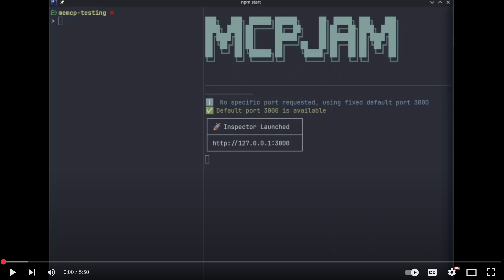
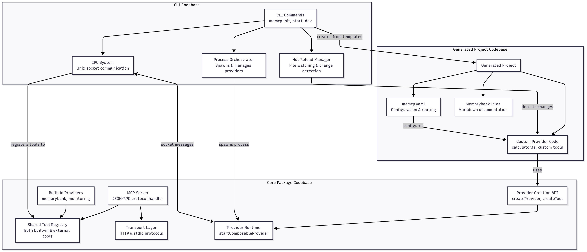
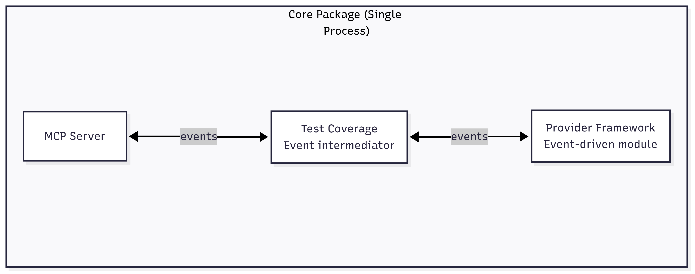
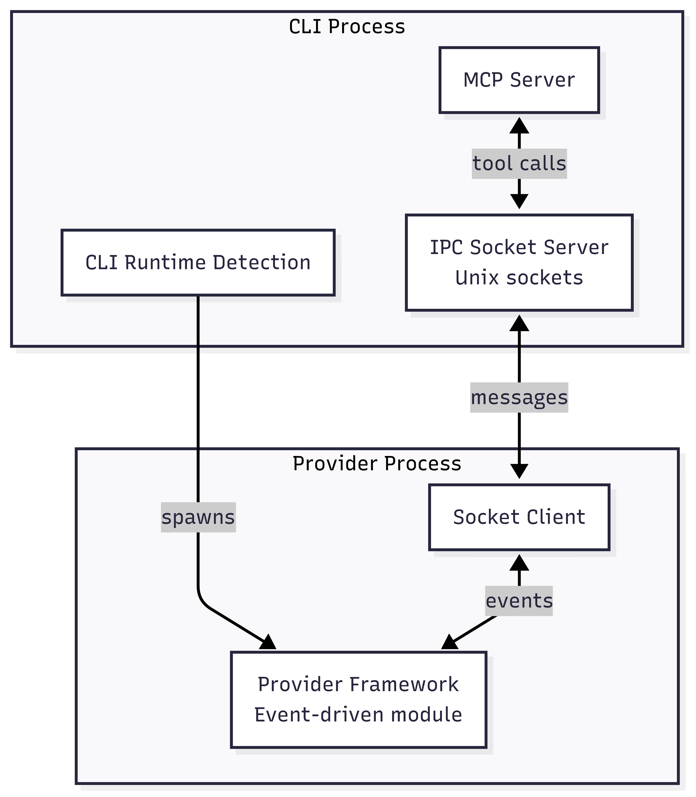
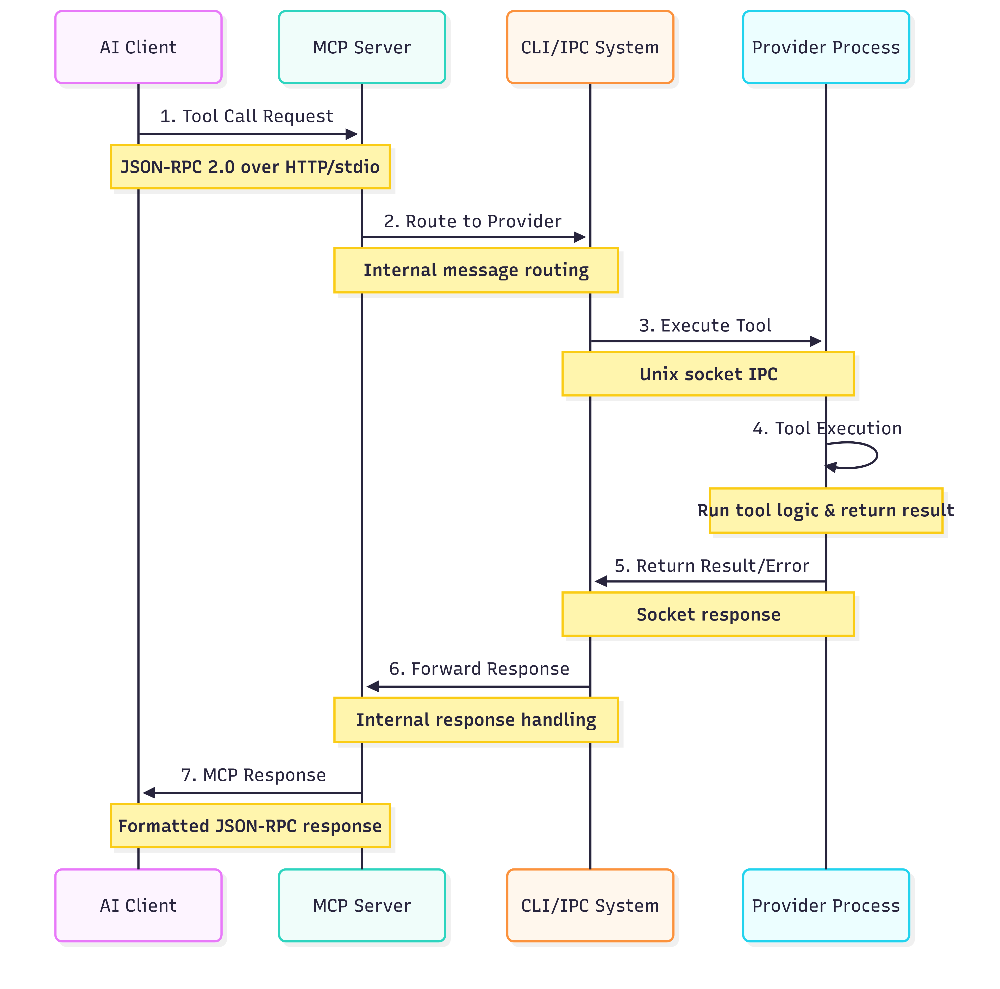

# MEMCP Project Notes

## Demo

<div align="center">
  <a href="https://www.youtube.com/watch?v=OximkI7MHw0" target="_blank">
    
  </a>
  <br>
  <a href="https://www.youtube.com/watch?v=OximkI7MHw0" target="_blank">Watch Demo Video on YouTube</a>
</div>

## Project Vision

### Core Concept
**MEMCP** - A composable and portable toolset framework for AI-assisted workflows that enables teams to build, share, and maintain AI tool infrastructure.

### Background & Motivation
This project emerged from extensive thinking about how to better leverage AI-assisted coding tools and how our work is evolving. The fundamental insight is based on an analogy about cars and roads: to effectively drive cars, we need good roads to drive them on. The agentic AI tools we use are like cars, and the toolsets around them that give context and interfaces to the outside world are like roads.

Just like cars and roads, individual AI tools can be maintained separately, but the infrastructure really needs to be a community effort that we build together. This is where MEMCP comes in - creating the "roads" that enable AI tools to operate effectively.

### Foundational Analogy
- **AI Tools = Cars**: Individual AI agents/assistants that can be independently maintained
- **MEMCP = Roads**: The infrastructure that enables AI tools to operate effectively
- **Key Insight**: While individual AI tools can be maintained independently, the infrastructure needs to be a community effort

### Primary Goals
1. Create composable toolsets that plug into any generative AI language tool
2. Enable easy sharing of AI tool configurations across teams/companies
3. Make tool creation as simple as writing a TypeScript function
4. Provide a Rails-like developer experience for AI tool infrastructure
5. Build a "brain" for AI tooling that can be version-controlled and shared turnkey

---

## Developer Experience

### Project Initialization
```bash
memcp init  # Creates new TypeScript project with demo toolset
```

The developer experience draws heavily from Ruby on Rails, where a CLI tool can both scaffold out a new project and serve the scaffolded project.

### Project Structure
```
my-project/
├── memcp.yaml           # Configuration epicenter
├── providers/           # Tool bundles
│   └── calculator.ts    # Example provider with tools
├── memorybank/         # Markdown documentation folder
│   └── *.md           # Documentation files
└── package.json        # Standard TypeScript project
```

### Server Commands
```bash
memcp start  # Production server
memcp dev    # Development server with hot reload
```

---

## Core Components

### 1. Providers
- **Definition**: Bundles of MCP tools built through composable functions
- **Structure**: Each tool = schema + execute function
- **State Management**: Providers can initialize and track state for tool groups
- **Lifecycle**: Handle reload/reinitialization on configuration changes
- **Language Support**: Currently TypeScript/JavaScript (framework supports any language)

#### Example Provider Structure
```typescript
// Each tool created by passing schema and execute function
const tool = createTool({
  inputSchema: {...},
  execute: async (params) => {...}
});

// Provider wraps tools with lifecycle management
const provider = createProvider({
  tools: [tool1, tool2],
  initialize: async () => {...},
  // Handle configuration changes
});
```

### 2. Memorybank
- **Purpose**: Serve markdown documentation to AI tools
- **Structure**: Folder containing markdown files in any structure
- **Access**: Tools for navigation, discovery, and fetching relevant docs
- **Current State**: Basic fetch by URI (proof of concept)
- **Future Plans**: 
  - Semantic search
  - Reranking strategies
  - Document group fetching
  - RAG (Retrieval Augmented Generation) strategies

### 3. Configuration System
- **Central File**: `memcp.yaml`
- **Capabilities**:
  - Inline provider configuration
  - Environment variable routing
  - Sensitive config in gitignored files
  - Hot reload on configuration changes
- **Example**: Calculator precision configuration that updates without restart

---

## Architecture Overview

### In depth documentation

- [General Architecture](01-general-architecture.md) - Detailed architectural overview and design principles
- [IPC Provider Interface](02-ipc-provider-interface.md) - Inter-process communication and provider interface specifications

### Dual Provider System Architecture

The system leverages a **dual provider architecture** that balances integration capabilities with extension flexibility:

<div align="center">
  
</div>

#### Built-in Providers
- **Integration**: Run directly within the main process for tighter CLI integration
- **Development**: Easier to develop and maintain as part of the core system
- **Capabilities**: Can access internal CLI state and provide seamless integration with system features
- **Examples**: Memorybank provider that needs direct file system access and configuration integration

#### External Providers
- **Flexibility**: Run as separate processes, enabling user extension and customization
- **Isolation**: Process boundaries provide safety and independent lifecycle management
- **Language Support**: Can be written in any language that supports the MCP protocol
- **Hot Reload**: Can be updated without affecting other providers or disconnecting clients

#### Core System Components

**1. Generated Project**
- **Content**: Custom provider code and memorybank markdown files that will ultimately get served
- **Execution**: Runs as a separate process using the Core package's provider APIs
- **Purpose**: User-created tools and documentation

**2. Core Package**
- **Content**: Logic for the MCP server and the provider framework
- **Usage**: Used both in the main process (for the server) and in provider processes (for the development APIs)
- **Purpose**: Protocol implementation and abstractions

**3. CLI Package**
- **Content**: Code to orchestrate all pieces together and central logic for IPC
- **Responsibility**: Mediates communication between the server and individual provider processes
- **Function**: Detects important events where a process needs to reinitialize and broadcasts those events
- **Purpose**: Coordination and lifecycle management

### Transport Flexibility
The MCP server complies with MCP standards and serves multiple transport protocols. MCP uses JSON-RPC 2.0, but it can be served over stdio or HTTP.

- **Protocols**: HTTP, stdio, or both simultaneously
- **Implementation**: Core JSON-RPC module processes and intermediates messages, then passes to configured transport
- **Use Cases**:
  - **stdio**: Managed by tools like Claude Desktop (convenient process management)
  - **HTTP**: Better for debugging and cloud deployment
  - **Both**: Background stdio + HTTP for additional clients (e.g., Claude Desktop managing the process via stdio while other clients connect via HTTP)

---

## Technical Implementation

### Architectural Evolution

The current architecture evolved through three distinct iterations, each building on lessons learned from the previous:

#### **Iteration 1: Core Package Only**
Everything started with a single core package containing both the MCP server and provider framework. The provider framework was an event-driven module that could broadcast and receive events about lifecycle, configuration, initialization, and tool execution. Test coverage was used to connect the MCP server and provider framework in a way that would eventually be intermediated by IPC.

<div align="center">
  
</div>


#### **Iteration 2: Adding IPC Layer**

Once the core package was working, the IPC piece was added to the CLI. The IPC works over Unix sockets to transmit messages across processes. The CLI detects the proper runtime for a particular process that gets spawned, and the process initiates a connection to a common socket where messages can be exchanged.

<div align="center">
  
</div>

#### **Final Iteration: Three-Codebase Architecture**

This evolved into the current three-codebase system with complete separation of concerns and the dual provider architecture we have today.

### Process Architecture
- **Process Orchestration**: CLI launches separate runtimes for each provider
- **Isolation**: Each provider runs in its own process
- **Communication**: Unix sockets for IPC message exchange
- **Hot Reload**: Individual providers reload without affecting others

### Message Flow
When a tool call happens:

<div align="center">
  
</div>

**Step-by-Step Breakdown:**

1. **Tool Call Request** → MCP Server receives the request
2. **Message Routing** → CLI sends a message across the socket with the provider and tool that needs to receive the message
3. **Tool Execution** → Provider that matches the tool call receives the message, makes the proper tool call
4. **Response** → Provider returns a result message with successful result or error
5. **MCP Response** → Server formats and returns to client


---

## Key Features Demonstrated

### 1. Low-Friction Tool Creation
- NPM ecosystem integration (example: adding Algebrite computer algebra system)
- Simple function-based tool definitions
- Immediate availability after creation
- No server restart required

### 2. Configuration Management
- Live configuration updates (precision changes applied instantly)
- Environment variable support
- Per-provider configuration routing
- Hot reload on configuration changes

### 3. Hot Reload Capabilities
- File watching for changes
- Automatic provider reinitialization
- State preservation across reloads
- No server restart required
- Individual provider isolation

### 4. MCP Compliance
- Full MCP protocol support
- Compatible with any MCP client
- Tool inspection and testing via MCP Inspector
- JSON-RPC 2.0 compliance

---

## Future Development Plans

### Immediate Improvements
1. Enhanced memorybank with RAG strategies
2. Semantic search capabilities
3. Document grouping and reranking

### Architecture Evolution
1. Ground-up rewrite incorporating learned patterns
2. Improved IPC architecture
3. Extended language support beyond TypeScript

### Vision
- **Turnkey AI Brains**: Version-controlled, shareable AI tool configurations
- **Team Collaboration**: Pull repo → install memcp → ready-to-use AI setup
- **Infrastructure as Code**: for AI tooling

---

## Use Case Example

### Workflow Demonstration
1. Initialize project with `memcp init`
2. Add NPM package (e.g., Algebrite for computer algebra)
3. Create tool with simple definition
4. Tool immediately available to AI without restart
5. Share repository with team
6. Team members clone and run with single command

### Power Features
- Database connections via NPM packages
- Infrastructure integration through custom tools
- Documentation serving through memorybank
- Configuration-driven behavior changes

